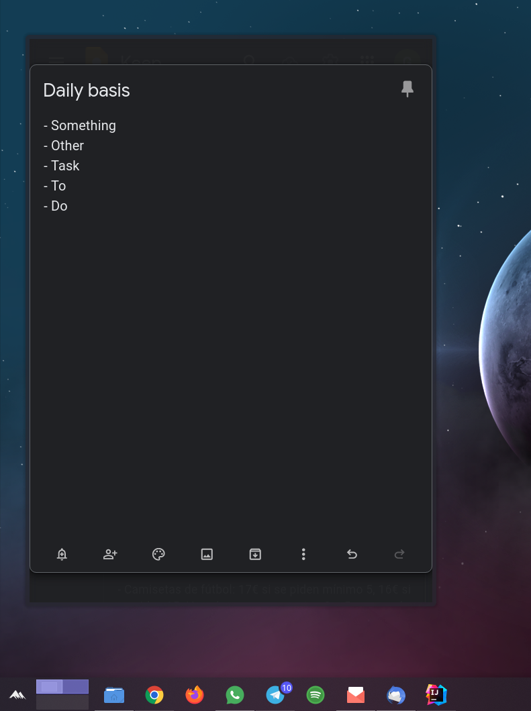

# Google Keep widget for KDE Plasma 5

### KDE 5 widget to display notes from Google Keep in desktop screen.

    
    &nbsp;&nbsp;&nbsp;&nbsp;&nbsp;
    
    &nbsp;&nbsp;&nbsp;&nbsp;&nbsp;
    
    &nbsp;&nbsp;&nbsp;&nbsp;&nbsp;
    

## Installation

Firstly, we need to install **qt5-webview**, which it's the only **dependency** the plasmoid has.

    sudo pacman -Syu qt5-webview

We can install [**Webslice** KDE 5 Applet](https://store.kde.org/p/998902/) by going to the website, downloading the zip and installing the plugin, or we can just use KDE plugin installer either way.

## Usage

When all has been installed, it's time to configure it.

The plasmoid is designed to show just a note at the same time, so you should do the following configuration:
1. **Copy URL** of certain Google Keep note.
2. Go to desktop environment, **add a Webslice plasmoid**.
3. Open Webslice plasmoid configuration.
4. In *General tab*, **paste Google Keep note URL**.
5. In *Advanced tab*, copy content from file [GoogleKeepWidgetDesign.js](./GoogleKeepWidgetDesign.js) and paste it on 
tab's last field for **personalized javascript execution**.
6. Save settings.

## Screenshots

